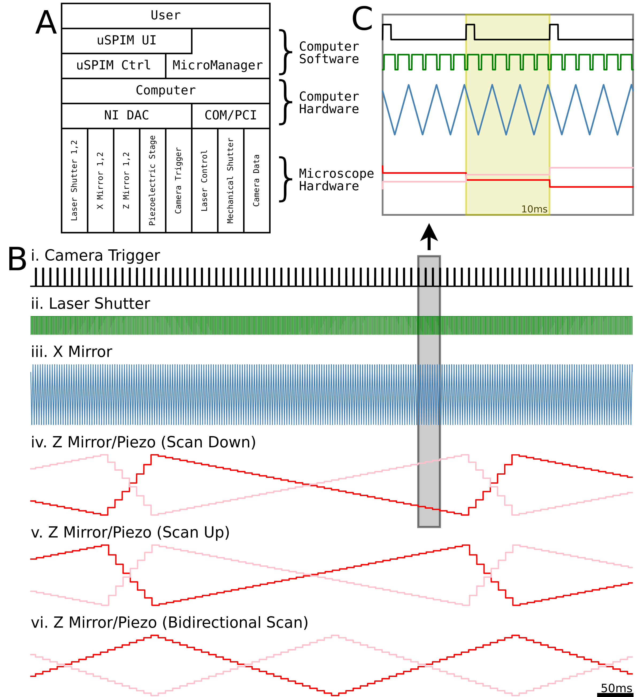

# What is μSPIM?
μSPIM Toolset is a an all-in-one control solution for a Selective Plane Illumination Microscope (SPIM), build around the open-source [Micro-Manager platform](https://micro-manager.org/) that has been adopted in a wide range of imaging solutions. The main aim of the project is to providea pen-source flexible and hardware-agnostic software solution that can be adapted to the specific lightsheet imaging applications while retaining a gentle learning curve.

Learn more here: [https://doi.org/10.1101/2020.06.15.151993](https://doi.org/10.1101/2020.06.15.151993)

## Repositories
Micro-Manager extension: [https://github.com/DanielSaska/uspim-mm](https://github.com/DanielSaska/uspim-mm)  
Control server: [https://github.com/DanielSaska/uspim-ctrl](https://github.com/DanielSaska/uspim-ctrl)

# Principles of Operation
The μSPIM toolset consists of two main components: a Java plugin for MicroManager which facilitates all user interaction and configuration, and a C++ control executable which interacts with the National Instruments board to produce hardware control signals  (Figure below). These support the control of two scanning X mirrors for light sheet formation, two scanning Z mirrorsand one piezoelectric stage for a Z motion of the collection objective, two laser shutters for lasermasking and one trigger for the camera acquisition control and synchronization with otherhardware.  After   an   appropriate   setup,   the   Java   plugin   facilitates   all   necessary   tools   for calibration and control of the hardware, providing the users with an intuitive interface without requiring the need for specialized computer knowledge or programming, while allowing flexibility provided by MicroManager. 

# Citing μSPIM
TBD
