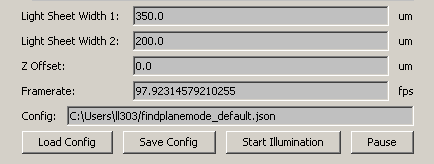

# Acquisition

## Find Plane Mode
The find plane mode supplies a simple sheet-generating functionality. With support for two laser paths, this mode is used to set up the laser width for both lasers individually. *Z Offset* is then used to set the height of the sheet - this setting affects the position of the position of the piezoelectric stage along with the Z-mirror galvanometer. The *Framerate* setting sets the framerate of the camera. The values used can be saved as default or as a preset by the buttons at the bottom. *Start Illumination* then sends a command to the control server to update the light sheet generation with the set parameters.

With the light sheet generated, the 'Live' mode can be enabled in MicroManager to find the sample. It is recommended to use position the lightsheet such that with *Z Offset* of 0, the lightsheet is at the top of the imaged sample/region.

## Acquiring Plane and Volume Recordings

Acquisition of both plane and volume recordings is done through the *Acquire Data* interface shown below. 

**Number of volumes** is the number of volumes or planes to be acquired. 
**Scan mode** is the mode of acquisition to be used. In *Bidirectional* mode, μSPIM acquires equal number of planes when moving up as when moving down. In the *Down* mode, acquisition is done when the laser is moving from the top of the sample down with several flyback frames in the other direction (read below). The *Up* mode functions in similar way as the *Down* mode except the acquisition is done when the sheet is moving from the bottom of the sample up. For acquisition of volumes, set this parameter as required by the particular application - note that while *Bidirectional* mode offers best utilization of hardware as no frames need to be sacrificed for flyback, the acquired frames are not equally spaced in time since the order acquisition alters between top-down and bottom-up. For plane recordings, set this setting to *Down* or *Up*. 
**Number of planes** Number of planes acquired per volume. Set this to the desired number for volume recordings or 1 for plane recordings. 
**Flyback** This parameter controls how many frames are taken to move the collection objective from the end of the acquired volume back to the start in *Up* and *Down* acquisition modes. This is required in almost all volumetric recordings as the piezoelectric stage is unable to move the collection objective instantly and fast movements produce oscillations, reducing the quality of the recordings. The number of flyback planes will scale linearly with the depth of the volume and will vary with hardware used. Visual inspection of the recordings or position of the stage using an oscilloscope can be used to determine a sufficient number of flyback planes. For plane recordings, set this to 0. 
**Z start** is the position of the top of the acquired sample volume/plane in micrometers. Buttons on the right can be stepped through the sample. The lightsheet will be moved live to ease the adjustment of the volume start. 
**Z end** is the position of the bottom of the acquired sample volume/plane in micrometers. This parameter can be adjusted similarly to **Z start** with buttons on the right. Set the end to be the same height as the start for plane recordings.

μSPIM allows some advanced acquisition options. At the moment **Light Adaptation** and **Sequential Acquisition** is available:

**Light Adaptation** starts the acquisition by positioning the light sheet at the *0.0* position for the set period of time. Pre-exposing the live sample reduces the amount of transient  neural activity caused by change of light exposure when the light sheet is turned on for recording. By ensuring the *0.0* position is above the sample, the bleaching of the sample is minimized during the adaptation phase. The adaptation phase is not recorded. 
**Sequential Acquisition** allows a sequential execution of multiple acquisition protocols. To add acquisition to the sequence, set the basic parameters above and then click *Add*. Multiple volume or plane recordings with varying parameters can be acquired without the need for interaction between them using this feature.

*Start Acquisition* prepares MicroManager for acquisition and then starts the illumination protocol through the control server executable. In the case of sequential acquisition, this is done several times after each recording ends.

For each acquisition, the user has the option to fill out details about the animal sample imaged, description of the recording and the experiment the recording is part of (figure below). This information is stored in the JSON metafile saved along with the recorded imagery and can be used for cataloging purposes.

