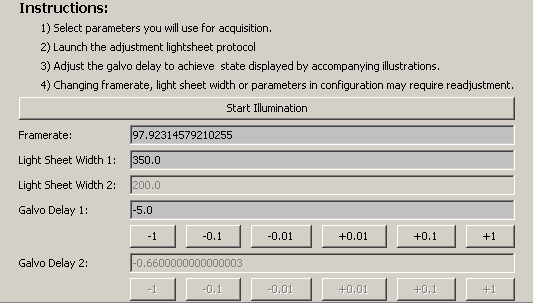
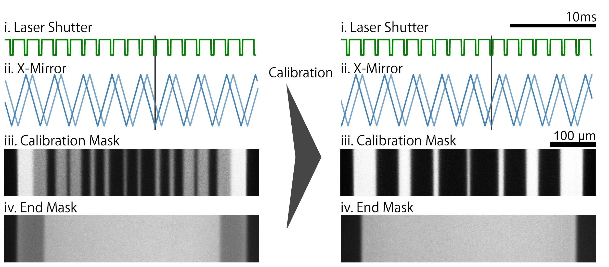
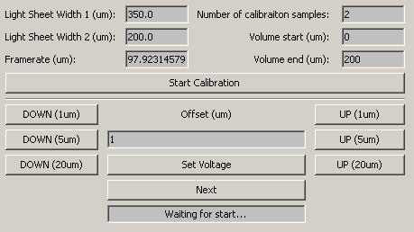
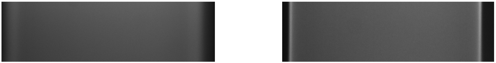

# Software Calibration

## X-mirror calibration

[Masking](/masks.md) is one feature of μSPIM which can be helpful in some applications to achieve more uniform illumination. This is enabled by synchronous shuttering of the laser source along with the movement of the galavanometric mirror which forms the sheet. Depending on the selection of hardware, the mirror galvanometer will always lag behind the signal (see ii. below, dark blue is signal, light blue is mirror position). This creates a horizontal shift in the mask applied by the laser shutter, where the mask is shifted in the opposing directions as the mirror scans from left to right and vice-versa. To avoid this, the X-mirror signal timing can be adjusted relative to the laser shutter, compensating for the delay (compare ii. on the left and right, black line). 

During calibration, a calibration mask is displayed to aid the process. Figure below shows the mask when hardware is not calibrated (iii. left) and after proper calibration is achieved (iii. right).

Proper calibration allows good masking results (compare iv. above, left, before calibration, vs right, after calibration).

## Z-mirror calibration

SPIM allows volumetric imaging at a high speed. This is achieved by synchronous movement of the piezoelectric stage and the z-mirror galvanometer. It is important that both the stage and the sheet move same distance such that the relative distance between the collection objective and the sheet is constant. When this is not the case, the image will go out of focus with changing Z position.

μSPIM Toolset supplies a simple calibration procedure to ensure synchronous movement of the two components. Start by putting diluted FITC solution into the sample chamber. Next, under Z-mirror calibration select the appropriate sheet width and framerate. The number of calibration samples indicates how many planes are going to be used for calibration. Minimum of 2 being the start and end of the volume and any additional plane is then selected in between them with equal spacing. 4 sample planes are generally more than sufficient to obtain a good calibration result. The volume start and end should be selected such that the calibration volume covers the largest possible volume imaged.

After pressing 'Start Calibration' move the collection objective stage such that the light sheet is in focus.
nd press 'Next'. From this point, all adjustments should be done through the software. Use the buttons on the left and right or set the voltage directly such that the sheet is in focus (figure below, right) and press 'Next'. Repeat this step as many times as necessary (depends on the n. of calibration samples selected) and at the end a linear scaling factor for the Z mirror will be displayed. Input this value in the Settings tab and save the settings if you wish to make the changes permanent. The Z-mirror movement should now be calibrated and the sheet should be in focus throughout the full volume when imaging.

