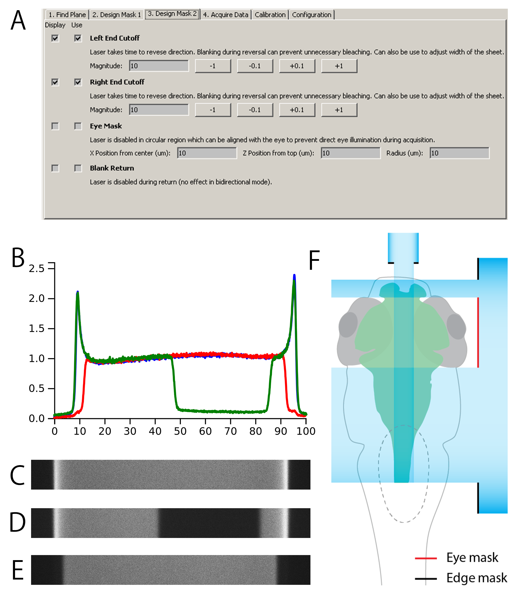

# Masking

Masking can be useful to reduce illumination of undesired regions. Currently, there is 4 masks available:

**Left and Right End Cutoff** masks provide the ability to shutter the ends of the lightsheet, either reducing the width of the sheet (however this should preferably be done by reducing the width of the sheet itself) or removing the regions over-illuminated by the laser when it changes direction at the ends of the lightsheet (compare figure above, C without masks and E with cutoff masks). 
**Eye Mask** allows creation of a shuttered region in the middle of the light sheet, creating two illuminated regions (see D above). This can be used in cases where it is necessary to avoid illumination of a certain region in the sample. F in figure above illustrates this (Eye mask indicated in red). 
**Blank Return** shutters the laser during flyback (see [Acquisition](/acquisition.md)), reducing photo-bleaching during time when frames are being acquired.

Note that for masking to function properly, the X mirror must be [calibrated properly](/calibration.md).
