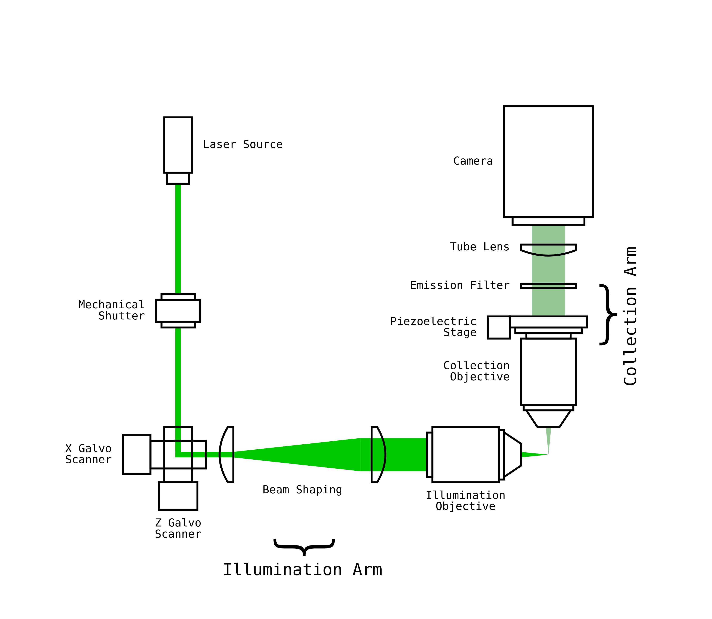
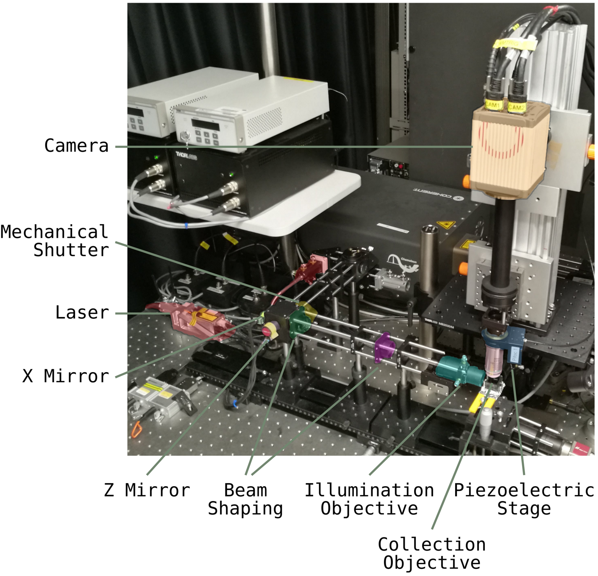
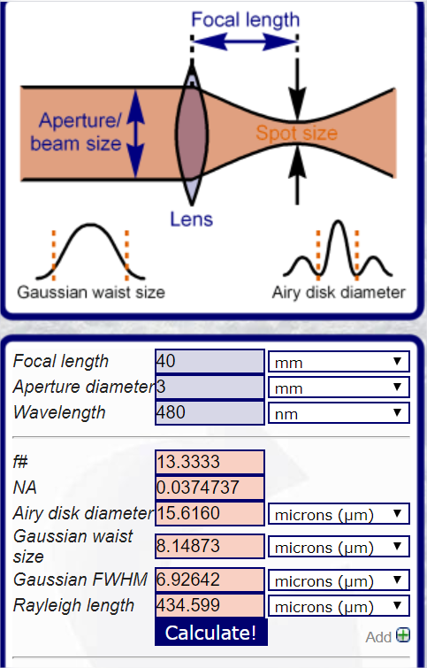
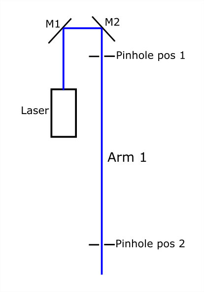
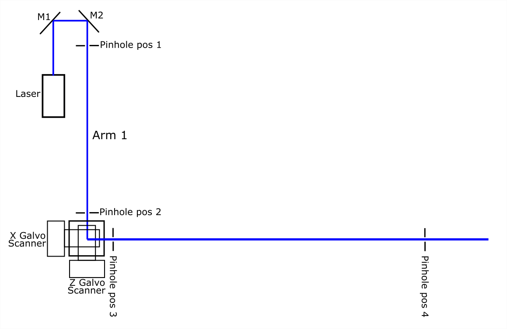
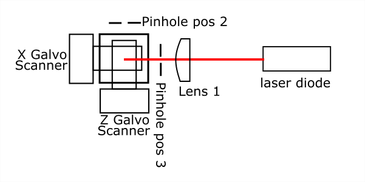
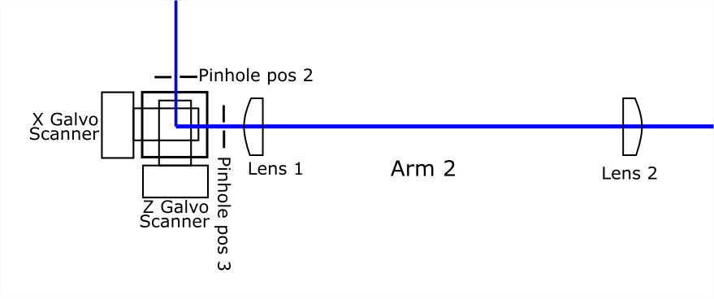
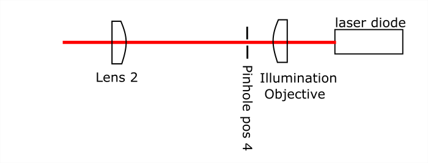

# Microscope Hardware

## Example Microscope Setup
| Mechanical Parts   | Component (Manufacturer)                                                                |
|--------------------|-----------------------------------------------------------------------------------------|
| Optical table      | 1.4 x 1.8 x 0.2 m clean top on Micro-g Pneumatic and Rigid Legs (TMC Vibration Control) |
| Rail systems       | Precision 100 mm Dovetail Optical Rails with PRC carriers (Newport)                     |
| Translation stages | XR25C/M (Thorlabs)                                                                      |

| Illumination Arm Parts         | Component (Manufacturer)                                                          |
|--------------------------------|-----------------------------------------------------------------------------------|
| Lasers                         | LuxX+ 488 nm 60 mw (Omicron) Jive 561 nm 100 mW (Cobolt)                          |
| Optical Fibre and Laser Launch | Kineflex Fibre system (0.7 mm), 400-640nm, 2m, FC/APC connectors (Qioptiq)        |
| Mechanical Shutter             | SH05/M shutter and SC10 controller (Thorlabs)                                     |
| Beam expander 2.5x             | f = 50 mm achromat (AC254-050-A, Thorlabs) and f = 125 mm achromat (Edmund Optic) |
| Dual-axis galvanometer scanner | GVS102 - 2D Galvo System (ThorLabs)                                               |
| Illumination lens              | f = 40 mm achromat (#49-354-INK, Edmund Optics)                                   |

| Collection Arm Parts        | Component (Manufacturer)                                                                |
|-----------------------------|-----------------------------------------------------------------------------------------|
| Camera                      | ORCA-flash4.0 v2                                                                        |
| Laser cleanup notch filters | 488/10, and 561/10 (Chroma)                                                             |
| Detection objective         | 16X/0.8NA CFI LWD Plan Fluorite (Nikon)                                                 |
| Piezoelectric stage         | PIFOC E-665 amplifier/controller + P-725 (400 um travel range from Physike Instrumente) |
| Emission filter             | 535/35 (xf3007, Omega)                                                                  |
| Tube lens                   | f= 200 mm achromat (AC508-200, Thorlabs)                                                |
| Mounting of collection arm  | X-95 mounting system and carriers (Linos)                                               |

## Illumination Arm

In the illumination arm, the laser beam passes a Mechanical Shutter and is reflected by a pair of X and
Z Galvo scanner mirrors (GVS102, Thorlabs, Inc). Then it is expanded by the Beam Shaping lenses. The focal
lengths for the first lens and second lens (from left to right) is 50mm (AC254-050-A, Thorlabs) and 125mm (#49-361-INK, Edmund Optics Ltd), respectively. The illumination objective is
40mm (#49-354-INK, Edmund Optics Ltd). With the rapid scanning of X Galvo mirror, the laser line
will form an illumination plane. The thickness of the beam waist is around 7um, with a Rayleigh
length of about 400 um.

## Detection Arm
For detection, a 16X/0.8NA Nikon CFI LWD Plan Fluorite objective is placed perpendicularly to the
illumination plane to collect the emission fluorescence signal. The excitation light is rejected by the
emission filter and then a tube lens of 200mm focal length (TTL200-A, Thorlabs, Inc) is used to create
an image onto the Hamamatsu Flash4.0 sCMOS camera. The objective lens is mounted on a
piezoelectric stage (P-721 PIFOC High-Precision Objective Scanner, Physik Instrumente Ltd). Its
movement is synchronised with the Z Galvo scanner to make sure the illumination plane is always in
the imaging focal plane. The objective and PIFOC scanner are mounted on a manual stage for finding
the focal plane before starting acquisition.
Note:
The beam parameters are calculated using: [http://www.calctool.org/CALC/phys/optics/f_NA](http://www.calctool.org/CALC/phys/optics/f_NA).

## Alignment
**Step 1** Align the illumination arm. Put an alignment plate with 0.9mm pinhole (Thorlabs CPA1) in
pinhole pos1 and adjust M1 to send the beam into the centre of the pinhole. Then move the
alignment plate to pinhole pos2 and adjust M2 to centre the beam in the target. Repeat this
step, until the beam can go through the pinhole centre in both positions.

**Step 2** Mount the Galvo scanners. Power on the scanners and set the scanners in the 0 offset
positions. Loose the fixing screws for both scanners and try to set the beam going through
the centre of the target placed at pinhole pos3 and pos4 by rotation the scanners. Adjust X
scanner for pos3 and Z scanner for pos4, respectively. (similar procedure as step 1)

**Step 3** Shine a laser diode (CPS635R, Thorlabs Inc) from the right side of lens 1, and adjust the
position of lens 1 to make sure the focal point is sitting between X and Z mirrors.

**Step 4** With the main laser on, move the position of lens 2 to get a collimated beam out of lens 2.

**Step 5** Placed the laser diode in the right side of illumination objective and shine the laser through
objective and lens 2. Move the position of illumination objective to get a collimated beam
out of lens 2.  
 
**Step 6** Mount objective, tube lens on the posts and stages. Make sure it’s right above the centre of
the sample chamber. Move the objective close to the sample plane, then shine a laser diode
(CPS635R, Thorlabs Inc) from the objective side. Check the light spot coming out of the tube
lens and move the tube lens up or down until the laser beam becomes collimated.  
**Step 7** Focusing the laser diode beam through the tube lens and adjust the camera’s position to
make sure the focus is on the imaging chip.  
**Step 8** Put diluted FITC media in the sample chamber and place the chamber on the sample holder.
Shine the blue laser through the illumination lens. Adjust the stage for detection arm and
make sure the focal point of the focused illumination beam can be seen in the centre of the
camera.

